# 📈 Stock Market Management System & Price Predictor

The **Stock Market Management System** is an intelligent Python desktop application designed to bridge the gap between portfolio simulation and predictive financial analytics. The application empowers users to manage their stock portfolios, simulate real-time buying and selling, and track wallet balances. 

Driven by historical market data, the core architecture integrates data analysis workflows to analyze asset trends and provide baseline price forecasts, offering a comprehensive playground for testing algorithmic trading strategies.

---

## 📋 Table of Contents

* [Key Machine Learning & Analytics Focus](#-key-machine-learning--analytics-focus)
* [Features](#-features)
* [Installation](#-installation)
* [Usage](#-usage)
* [Database Setup](#-database-setup)
* [ER Diagram](#-er-diagram)
* [Screenshots](#-screenshots)
* [Process Flow Diagram](#-process-flow-diagram)
* [Future Scope](#-future-scope)
* [License](#-license)

---

## 🧠 Key Machine Learning & Analytics Focus

Unlike static management platforms, this project emphasizes data-driven decision-making by tracking historical transaction variables and preparing structural patterns for predictive modeling:

* **Time-Series Baseline:** Utilizing historical closing price points stored within the database schema to analyze linear market trends.
* **Feature Engineering Vectors:** Tracking key user metrics, stock prices, and historical order flows that serve as foundational training inputs (features) for regression models.
* **Predictive Pipeline Readiness:** The application handles data sequencing, chronological data tracking, and data scaling to ensure predictive features avoid look-ahead bias during simulation.

---

## ERD

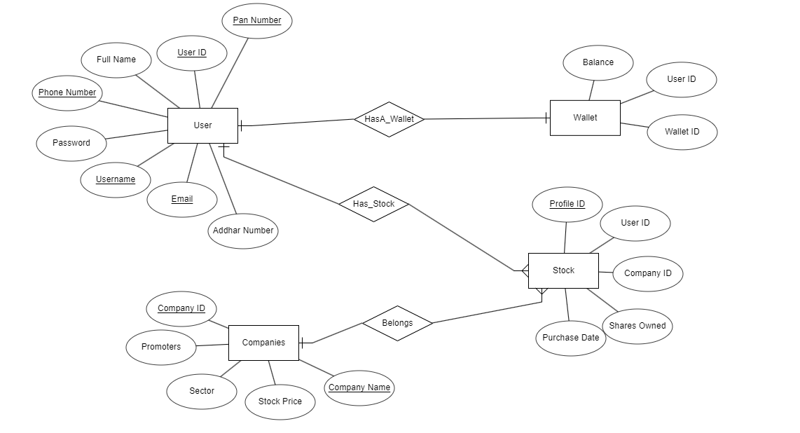

## Screenshots

### Home Page
#### Dark Theme
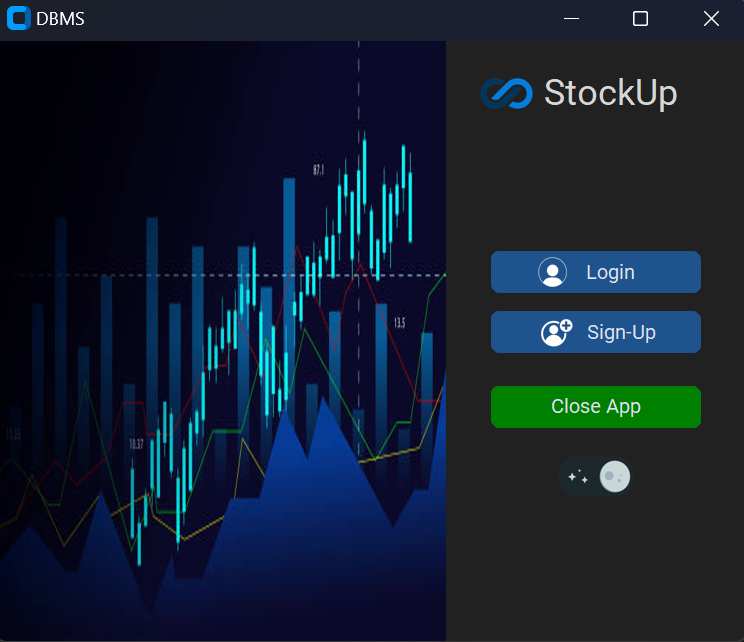
#### Light Theme
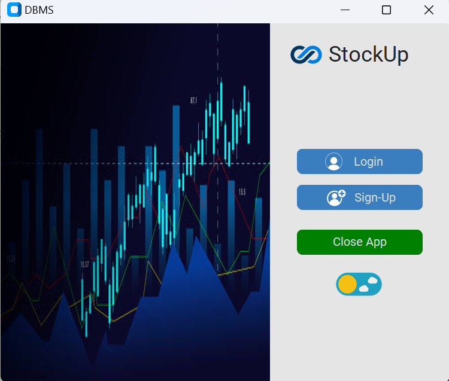

### Login Page
#### Dark Theme
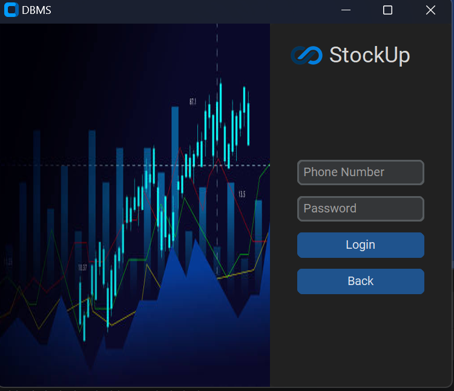
#### Light Theme
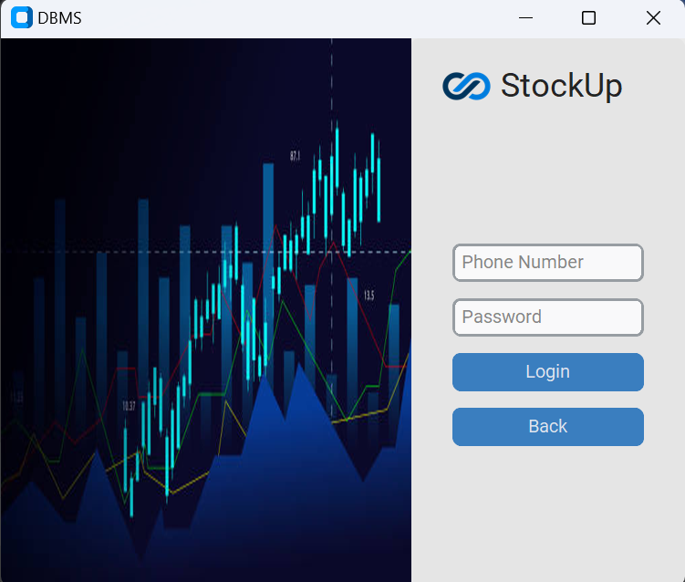

### Sign-Up Page
#### Dark Theme
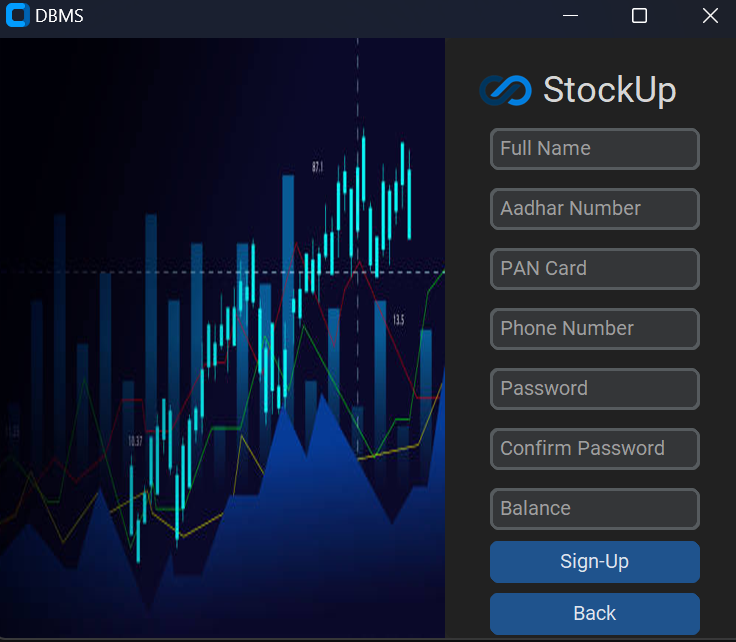
#### Light Theme
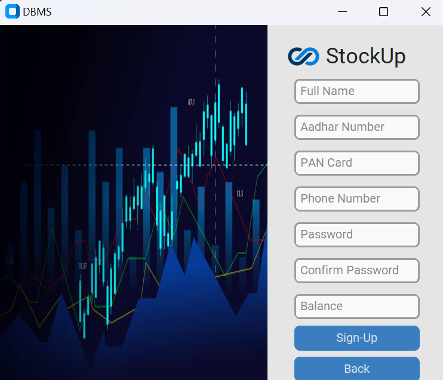

### Dashboard
#### Dark Theme
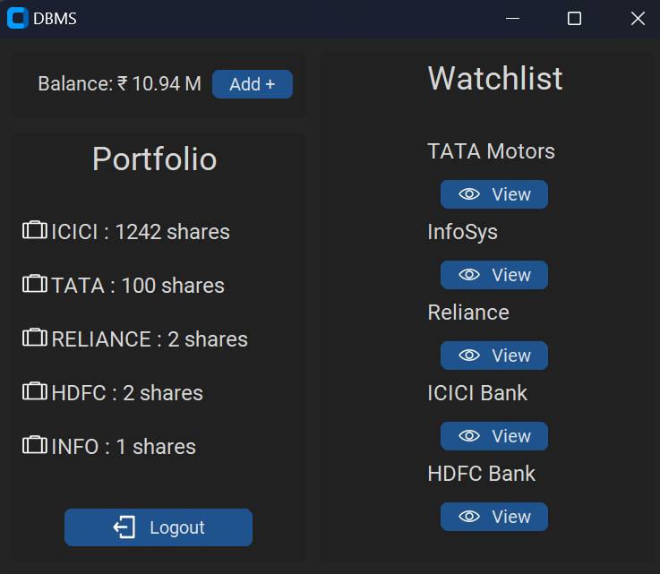
#### Light Theme
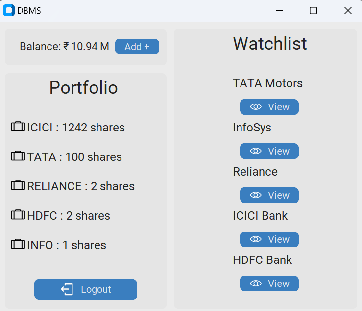

### Orders
#### Dark Theme <br>

#### Light Theme <br>


## Process Flow Diagram

### Login/Sign-up Workflow
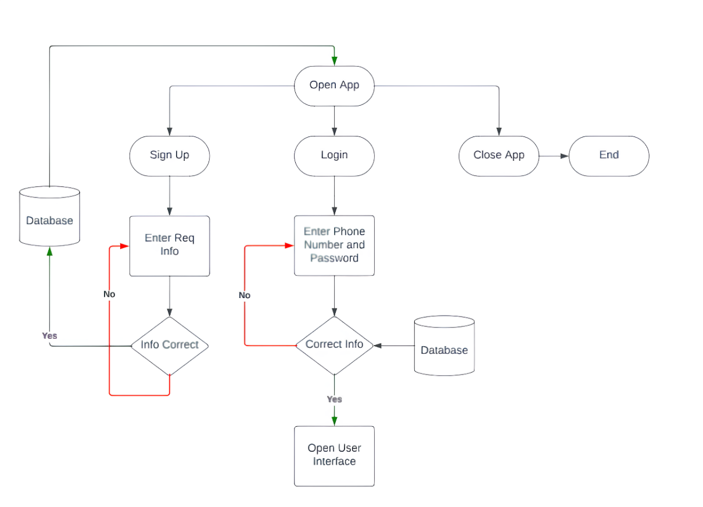

### Order Workflow
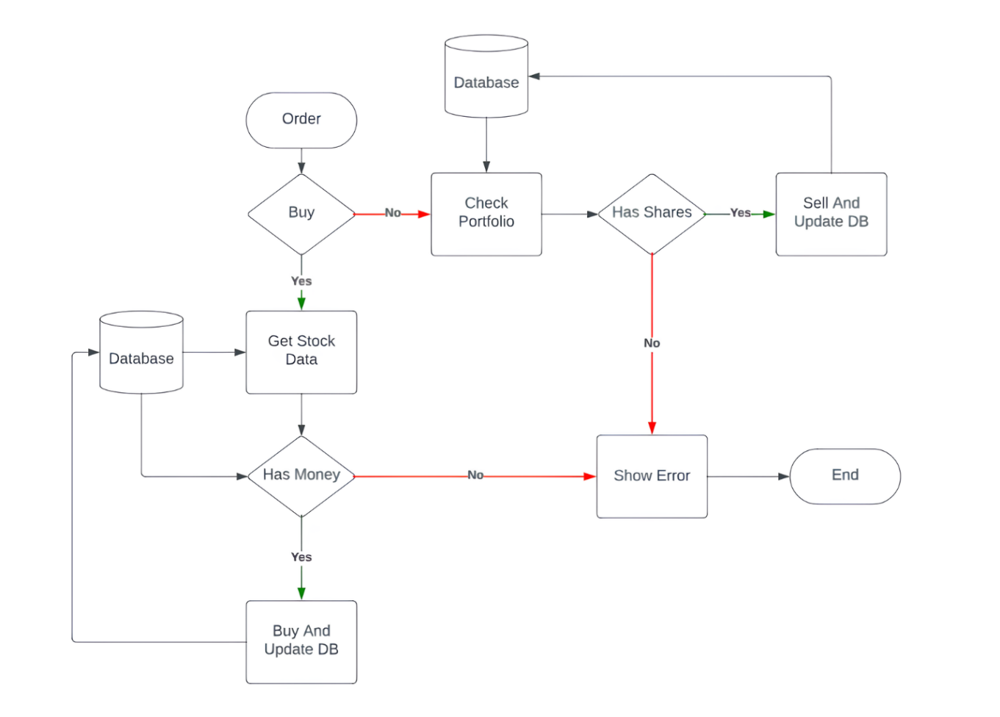

---

## ✨ Features

* **Predictive Asset Tracking:** Historical data structures designed to support trend analysis and asset forecasting models.
* **User Onboarding:** Secure user registration gathering essential structural details (Full Name, PAN card, Document verification placeholders, Phone Number) alongside an initial wallet balance setup.
* **Secure Authentication:** User login protected via phone number and password verification.
* **Wallet Management:** Real-time tracking of wallet balances with built-in functionality to add funds seamlessly.
* **Portfolio Tracking:** Dynamic portfolio management showing the breakdown of shares owned per company.
* **Trading Simulator:** Instant buying and selling of shares with dynamic stock prices fetched straight from the database.
* **Modern UI/UX:** A fully responsive, clean graphical interface built with `CustomTkinter` supporting both **Dark Theme** and **Light Theme** toggles.

---

## 🚀 Installation

### 1. Clone the repository to your local machine:
```bash
git clone [https://github.com/Auranzeb05/Stock-Price-Predictor.git](https://github.com/Auranzeb05/Stock-Price-Predictor.git)
cd Stock-Price-Predictor
